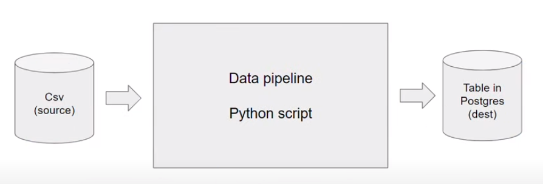
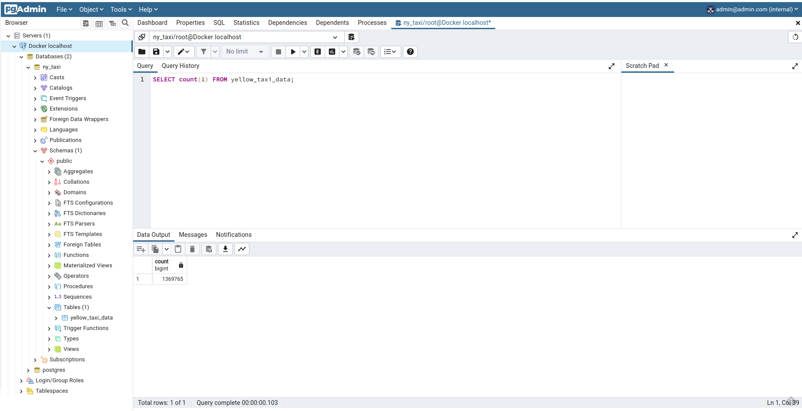
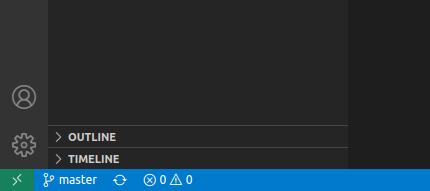

# Basics and Setup

## Table of contents
- [Architecture](#architecture) 
- [GCP](#gcp)
- [Docker and Postgres](#docker-and-postgres)
    - [Docker basic concepts](#docker-basic-concepts)
    - [Running Postgres in a container](#running-Postgres-in-a-container)
    - [Ingesting data into Postgres](#ingesting-data-into-postgres)
    - [Connecting pgAdmin and Postgres](#connecting-pgadmin-and-postgres)
    - [Dockerizing the Ingestion Script](#dockerizing-the-ingestion-script)
    - [Using Docker Compose](#using-docker-compose)


## Architecture

This is the architecture to work along in the course.


## Docker and Postgres

### Docker basic concepts
Docker delivers software in packages called containers, and containers are isoletd from one another.
A data pipeline is the process / service that gets in data and produces more data.



Why should we care about docker?
- Local experiments
- Integration tests (CI/CD)
- Reproducibility
- Running pipelines on the cloud (AWS Batch, Kubernetes jobs)
- Spark
- Serverless (AWS Lambda, Google functions)

* To use Linux on Windows, we can use `MINGW`. It comes with Git when it is installed in Windows.

After downloading Docker, to run a container, just type:

```bash
docker run -it python:3.9
```

If we want to import pandas in a container with that image, it has not pandas incorporated, so we can run the container from bash, and then do a pip install.

```bash
docker run -it --entrypoint=bash python:3.9
pip install pandas
```
Let's create a dummy `pipeline.py` python file, that takes in one argument and prints it:

```python
import pandas as pd
import sys

print(sys.argv)

day = sys.argv[1]

print(f'job finished successfully for day = {day}')
```

Now, let's put it into a container. This container is going to have a python 3.9 layer, pandas, we can do it through a `dockerfile`. A dockerfile is a file that specifies what is going to be inside the container. It needs be called dockerfile.

```dockerfile
FROM python:3.9

RUN pip install pandas

WORKDIR /app
COPY pipeline.py pipeline.py

ENTRYPOINT ["bash"]
```

To convert the dockerfile into an image, in the shell we run:

```bash
docker build -t test:pandas .
```
* The image name will be `test` and the tag `pandas`. if we don't specify a tag, the default is `latest`.

And then run it with:

```bash
docker run -it test:pandas 2023-01-01
```


### Running Postgres in a container

```bash
docker run -it \
    -e POSTGRES_USER="root" \ # to run environmental variables
    -e POSTGRES_PASSWORD="root" \
    -e POSTGRES_DB="ny_taxi" \
    -v $(pwd)/ny_taxi_postgres_data:/var/lib/postgresql/data \ # host_folder:container_folder
    -p 5432:5432 \ # host_port:container_port
    postgres:13
```
* enviromental variables: they can be set for the container
* volumes: a way to map folders of the host machine to a folder in the container. As Postgres is a database, we need to keep the files in a file system to save records...

Let's run a cli client, from our computer (not from inside the container) for accesing the database. For that purpouse, we are going to use `pgcli`, and can be install with `pip`:

```bash
pip install pgcli
```

After installing it, we can access the postgres database in the container that is up with:

```
pgcli -h localhost -p 5432 -u root -d ny_taxi
```
* `h` is the host. As we are running it locally we can use `localhost`
* `p` is the port
* `u` is the username
* `d` is the database we want to access

We will need to introduce the password that we set when running the container.

Postgres commands:
* `\dt` to show the tables in the database
* `\d table_name` to describe the table columns and types


### Ingesting data into Postgres

To populate the database, we are going to download data from the [New York taxi data](https://www.nyc.gov/site/tlc/about/tlc-trip-record-data.page):

```bash
wget https://d37ci6vzurychx.cloudfront.net/trip-data/yellow_tripdata_2021-01.parquet
```

As the code follows along the old data files in `csv` format (now they are in `parquet` format), we can download them from the **DataTalksClub github repo** in this [link](https://github.com/DataTalksClub/nyc-tlc-data).

The code for ingesting the Postgres database with the downloaded data is in [`upload-data.ipynb`](src/upload-data.ipynb).


### Connecting pgAdmin and Postgres

There is a more convinient way of writng queries to the database rather than using `pgcli`. There is another tool with a graphical user inteface, [`pgAdmin`](https://www.pgadmin.org/). We can install it, but since we are using docker, we can make it simpler and run it in a container. We can run it with:

```bash
docker run -it \
    -e PGADMIN_DEFAULT_EMAIL="admin@admin.com" \ # User name
    -e PGADMIN_DEFAULT_PASSWORD="root" \ # User password
    -p 8080:80 \ # Host port : Container port, we dont use host port 80 to avoid conflicts
    dpage/pgadmin4
```
Now, we can access pgAdmin through the web broser by typing: `localhost:8080`
If we try to connect to the postgres database we are running in another container, we have to specify the host machine. If we specify "localhost", **pgAdmin** is going to look inside its container, so won't be able to find **postgres**. That is because we need to create a `network` in docker to make available 2 containers to interact between them. 

To create a **docker network** we can run:

```bash
docker network create pg-network # pg-network is the name of the network we are creating
```

And then run the docker container specifying the name of the network we want to use, and the name that the container is going to have inside the network. This last name is the one we are going to use to refer to the container when we connect two or more containers. 

```bash
docker run -it \
    -e POSTGRES_USER="root" \
    -e POSTGRES_PASSWORD="root" \
    -e POSTGRES_DB="ny_taxi" \
    -v $(pwd)/ny_taxi_postgres_data:/var/lib/postgresql/data \
    -p 5432:5432 \
    --network=pg-network \
    --name pg-database \
    postgres:13

docker run -it \
    -e PGADMIN_DEFAULT_EMAIL="admin@admin.com" \
    -e PGADMIN_DEFAULT_PASSWORD="root" \
    -p 8080:80 \
    --network=pg-network \
    --name pgadmin \
    dpage/pgadmin4
```

Once we are inide **pgAdmin**, to connect to the postgres database, we make right click in _Server_ > _Register_ > _Server..._ 




### Dockerizing the Ingestion Script

Next, we will convert the later jupyter notebook into a script. So with that we can put it inside a container and run it.  
To export the notebook into a script, we can use the `nbconvert` functionality of jupyter:

```bash
jupyter nbconvert --to=script ipload-data-ipynb
```

We clean the output script and add a few new lines of code. We are going to use the library [`argparse`](https://docs.python.org/es/3/library/argparse.html). The complete script can be found in [this link](src/ingest_data.py).

To execute the script, we can run:

```bash
python ingest_data.py \
    --user=root \
    --password=root \
    --host=localhost \
    --port=5432 \
    --db=ny_taxi \
    --table_name=yellow_taxi_data \
    --url="https://github.com/DataTalksClub/nyc-tlc-data/releases/download/yellow/yellow_tripdata_2021-01.csv.gz" 
```

But, it is better if we put it inside a docker container. For that we need to create a `dockerfile`.

```dockerfile
FROM python:3.9

RUN apt-get install wget
RUN pip install pandas sqlalchemy psycopg2

WORKDIR /app
COPY ingest_data.py ingest_data.py

ENTRYPOINT ["python", "ingest_data.py"]
```

And build it with:

```bash
docker build -t taxi_ingest:v001 .
```
To run the container created, and taking as input the same parameters, we can run with `docker run`. We have to be aware to specify the network created and the host name:

```bash
docker run -it \
    --network=pg-network \
    taxi_ingest:v001 \
    --user=root \
    --password=root \
    --host=pg-database \
    --port=5432 \
    --db=ny_taxi \
    --table_name=yellow_taxi_data \
    --url="https://github.com/DataTalksClub/nyc-tlc-data/releases/download/yellow/yellow_tripdata_2021-01.csv.gz" 
```

In this way, when we run the container, we are running the script (as it is declared in the dockerfile that the entrypoint is **["python", "ingest_data.py"]**). Once the script finishes, the container will stop.


### Using Docker Compose
[`Docker Compose`](https://docs.docker.com/compose/) is a tool for defining and running multiple containers at the same time. With this tool we can run at the same time all the containers that we want, preventign to have to run each container at a time from the command line.  
First, we need to download and install the [tool](https://docs.docker.com/compose/install/other/) (in Windows and Mac, it comes along with docker desktop). Then we need to create a docker-compose file where we specify the containers and specifications we need to run. The file needs to be called `docker-compose.yaml`, and its format is `yaml`. We don't need to specify a **network** as docker compose will take care of that.
Some **Docker Compose** commands:
* `docker-compose` shows all different commands we can run
* `docker-compose up` will run the containers specify in the docker-compose.yaml file of the working directory
    * `docker-compose up -d` run in detached mode
* `docker-compose down` stop the containers

The `docker compose file` is like:
```yaml
services:
 # name of the container 1
 pgdatabase: # name of the container
   # image we are using
   image: postgres:13
   # environment variables we need to run
   environment:
     - POSTGRES_USER=root 
     - POSTGRES_PASSWORD=root 
     - POSTGRES_DB=ny_taxi
   # to persist data on the host machine
   volumes:
     - $ ../../ny_taxi_postgres_data:/var/lib/postgresql/data
   # port mapping
   ports:
     - 5432:5432
 # name of the container 2 ...
 pgadmin:
   image: dpage/pgadmin4
   environment:
     - PGADMIN_DEFAULT_EMAIL=admin@admin.com
     - PGADMIN_DEFAULT_PASSWORD=root
   ports:
     - 8080:80
```

## GCP and Terraform

### Google Cloud Platform
Google Cloud Platform (GCP) is a combination of cloud computing services offered by Google. It includes a range of hosted services for compute, sotrage and application development that run on Google hardware. Some of the topics of these services are: Compute, Management, Networking, Storage & Databases, Big Data, Identity & Security, and Machine Learning.

GCP generally works in terms of projects. You can create a new project or use and existing one which comes as default.

- GCP: steps

  1. Create a *project*, everything in GCP works inside projects. Choose a *project name* and a *project id*. This last one must be unique across the entire GCP environment.
  1. On the panel on the left, go to *IAM & Admin > Service Accounts > Create Service Account*: A **service account** is an account that you create for a service, as the name suggests, and a service could be anything (like a data pipeline, web service...), and everything this service need, would de configured here in this service account. For example, if the service needs access to the cloud storage, we will grant access to it here.
      1. Choose a *name* and a *service id*, this one does not need to be unique across GCP
      1. *Description* can be anything
      1. *Role*, choose Viewer for now to begin with. Click on *Done*
      1. With the *service account* created, the see that there are no *keys* created. Click on three dots under *Actions > Manage keys > Add Key > Create new key > JSON > Create*. With this last step, we download the json file into our local computer.
  1. Install the [*GCP SDK*](https://cloud.google.com/sdk/docs/install?hl=es-419), which is a CLI tool, that lets insteract with the cloud services. 
      - Check the version
      ```bash
      gcloud -v
      ```
  1. Set a environment variable to point to the downloaded GCP aut-keys, and login:
      ```bash
      export GOOGLE_APPLICATION_CREDENTIALS="<path/yo/your/service-account-authkeys>.json"

      gcloud auth application-default login
      ```
      - A popup window will appear and ask you to authenticate the local cli into the google cloud platform account. This is an OAuth authentication, but there are other ways to authenticate (for example for when you are in a virtual machine that does not have a web browser).

Next, let's do some more step to prepare for the 2 resources we are going to create later in GCP:

- Google Cloud Storage (GCS): Data Lake. It is like a bucket in our GCP environment
  1. Let's add more permissions for the service account. Go to *IAM & Admin > IAM*, select the service that we created in the previous step, and click on the pencil on the rigth. In the real world, we would not use the predefine roles, but customize them to have the permissions just to the buckets, tools the service is going to interact with. Normally, in *Production*, companies have one service for Terraform with admin roles, and other services with restricted roles for the pipelines, web services...
        1. Add the **Storage Admin** (this is not convinient in a *Production environment*, for but the purpose of the course it is ok). It allows to create buckets and files.
        1. Add the **Storage Object Admin** role.
        1. Add the **Big Query Admin** role.
    1. Enable the APIs to interact between the Cloud and our local CLI.
        1. https://console.cloud.google.com/apis/library/iam.googleapis.com
        1. https://console.cloud.google.com/apis/library/iamcredentials.googleapis.com
- BigQuery: Data Warehouse


### Terraform
[Terraform](https://www.terraform.io/) is an open source tool by HashiCorp, taht lets provision infrastructure resources with declarative configuration files. These resources can be VMs, containers, storage... Terraform uses an IaC ([Infrasturcture-as-Code](https://www.wikiwand.com/en/Infrastructure_as_code)) approach, which supports devops best practices for change management. It is like a git version control for infrastructure.

### Local Setup for Terraform and GCP
- *Terraform*: [Installation](https://developer.hashicorp.com/terraform/downloads?product_intent=terraform)
- *Terraform configuration*: The set of files used to describe infrastructure in Terraform is known as a Terraform ***configuration***. Terraform configuration files end up in `.tf` for files written in Terraform language or `tf.json` for JSON files. A Terraform configuration must be in its own working directory; you cannot have 2 or more separate configurations in the same folder. There are mainly 3 configuration files:

  - `terraform version`: states what version of terraform we have installed and is going to use with the terraform commands. This is the native way, but alternatively we can also use for this purpose [`tfenv`](https://github.com/tfutils/tfenv), which is an environmental plug-in client.
  - `main.tf`: Here's a basic `main.tf` file written in Terraform language with all of the necesary info to describe basic infrastructure:

    ```java
    terraform {
      required_providers {
        google = {
          source = "hashicorp/google"
          version = "3.5.0"
        }
      }
    }

    provider "google" {
      credentials = file("<NAME>.json")

      project = "<PROJECT_ID>"
      region  = "us-central1"
      zone    = "us-central1-c"
    }

    resource "google_compute_network" "vpc_network" {
      name = "terraform-network"
    }
    ```
    * Terraform divides information into ***blocks***, which are defined within braces (`{}`), similar to Java or C++. However, unlike these languages, statements are not required to end with a semicolon `;` but use linebreaks instead.
    * By convention, arguments with single-line values in the same nesting level have their equal signs (`=`) aligned for easier reading.
    * There are 3 main blocks: `terraform`, `provider` and `resource`. There must only be a single `terraform` block but there may be multiple `provider` and `resource` blocks.
    * The `terraform` block contains settings:
        * The `required_providers` sub-block specifies the providers required by the configuration. In this example there's only a single provider which we've called `google`.
            * A _provider_ is a plugin that Terraform uses to create and manage resources.
            * Each provider needs a `source` in order to install the right plugin. By default the Hashicorp repository is used, in a similar way to Docker images.
                * `hashicorp/google` is short for `registry.terraform.io/hashicorp/google` .
            * Optionally, a provider can have an enforced `version`. If this is not specified the latest version will be used by default, which could introduce breaking changes in some rare cases.
        * We'll see other settings to use in this block later.
    * The `provider` block configures a specific provider. Since we only have a single provider, there's only a single `provider` block for the `google` provider.
        * The contents of a provider block are provider-specific. The contents in this example are meant for GCP but may be different for AWS or Azure.
        * Some of the variables seen in this example, such as `credentials` or `zone`, can be provided by other means which we'll cover later.
    * The `resource` blocks define the actual components of our infrastructure. In this example we have a single resource.
        * `resource` blocks have 2 strings before the block: the resource ***type*** and the resource ***name***. Together the create the _resource ID_ in the shape of `type.name`.
        * About resource types:
            * The first prefix of the resource type maps to the name of the provider. For example, the resource type `google_compute_network` has the prefix `google` and thus maps to the provider `google`.
            * The resource types are defined in the Terraform documentation and refer to resources that cloud providers offer. In our example [`google_compute_network` (Terraform documentation link)](https://registry.terraform.io/providers/hashicorp/google/latest/docs/resources/compute_network) refers to GCP's [Virtual Private Cloud service](https://cloud.google.com/vpc).
        * Resource names are the internal names that we use in our Terraform configurations to refer to each resource and have no impact on the actual infrastructure.
        * The contents of a resource block are specific to the resource type. [Check the Terraform docs](https://registry.terraform.io/browse/providers) to see a list of resource types by provider.
            * In this example, the `google_compute_network` resource type has a single mandatory argument called `name`, which is the name that the resource will have within GCP's infrastructure.
                * Do not confuse the _resource name_ with the _`name`_ argument!
  - `variables.tf`: includes **input variables** and **local variables**
    * ***Input variables*** block types are useful for customizing aspects of other blocks without altering the other blocks' source code. They are often referred to as simply _variables_. They are passed at runtime.
      ```java
      variable "region" {
          description = "Region for GCP resources. Choose as per your location: https://cloud.google.com/about/locations"
          default = "europe-west6"
          type = string
      }
      ```
      * Description:
          * An input variable block starts with the type `variable` followed by a name of our choosing.
          * The block may contain a number of fields. In this example we use the fields `description`, `type` and `default`.
          * `description` contains a simple description for documentation purposes.
          * `type` specifies the accepted value types for the variable
          * If the `default` field is defined, the variable becomes optional because a default value is already provided by this field. Otherwise, a value must be provided when running the Terraform configuration.
          * For additional fields, check the [Terraform docs](https://www.terraform.io/language/values/variables).
      * Variables must be accessed with the keyword `var.` and then the name of the variable.
      * In our `main.tf` file above, we could access this variable inside the `google` provider block with this line:
          ```java
          region = var.region
          ```
    * ***Local values*** block types behave more like constants.
        ```java
        locals{
            region  = "us-central1"
            zone    = "us-central1-c"
        }
        ```
        * Description:
            * Local values may be grouped in one or more blocks of type `locals`. Local values are often grouped according to usage.
            * Local values are simpler to declare than input variables because they are only a key-value pair.
        * Local values must be accessed with the word `local` (_mind the lack of `s` at the end!_).
            ```java
            region = local.region
            zone = local.zone
            ```

Terraform only have a few commands for execution:
- `terraform init`: Initialize & install the requiered pulgins, for example the GOOGLE provider. 
- `terraform plan`: Shows the execution plan. Match changes against the previous state
- `terraform apply`: Apply changes to cloud
- `terraform destroy`: Remove your stack from cloud


### Creating GCP infrastructure with Terraform

_([Video source](https://www.youtube.com/watch?v=dNkEgO-CExg&list=PL3MmuxUbc_hJed7dXYoJw8DoCuVHhGEQb&index=10))_

We will now create a new `main.tf` file as well as an auxiliary `variables.tf` file with all the blocks we will need for our project.

The infrastructure we will need consists of a Cloud Storage Bucket (`google_storage-bucket`) for our _Data Lake_ and a BigQuery Dataset (`google_bigquery_dataset`).

In `main.tf` we will configure the `terraform` block as follows:
```java
terraform {
  required_version = ">= 1.0"
  backend "local" {}
  required_providers {
    google = {
      source  = "hashicorp/google"
    }
  }
}
```
* The `required_version` field states the minimum Terraform version to be used.
* The `backend` field states where we'd like to store the _state_ of the infrastructure. `local` means that we'll store it locally in our computers. Alternatively, you could store the state online.

The provider will not make use of the `credentials` field because when we set up GCP access we already created a `GOOGLE_APPLICATION_CREDENTIALS` env-var which Terraform can read in order to get our authentication keys.

In the `variables.tf` we will store variables that may change depending on your needs and location. The ones to note are:
* `region` may vary depending on your geographical location; change it according to your needs.
* `BQ_DATASET` has the name of the table for BigQuery. You may leave it as it is or change it t fit your needs.
* `project` is the Project ID of your project in GCP. SInce the ID is unique, it is good practice to have Terraform as for it every time in case the same code is applied on different projects.

You may access [`main.tf` from this link](../1_intro/terraform/main.tf) and [`variables.tf` from this link](../1_intro/terraform/variables.tf). Take a look at them to understand the details of the implementation. Copy them to a new folder within your work directory so that the subfolder only contains the Terraform configuration files. Now run the following commands:

```bash
terraform init
```

This will download the necessary plugins to connect to GCP and download them to `./.terraform`. Now let's plan the infrastructure:

```bash
terraform plan
```

Terraform will ask for your Project ID. Type it and press enter to let Terraform access GCP and figure out what to do. The infrastructure plan will be printed on screen with all the planned changes marked with a `+` sign next to them.

Let's apply the changes:

```bash
terraform apply
```

You will need to confirm this step by typing `yes` when prompted. This will create all the necessary components in the infrastructure an return a `terraform.tfstate` with the current state of the infrastructure.

After you've successfully created the infrastructure, you may destroy it so that it doesn't consume credit unnecessarily:

```bash
terraform destroy
```

Once again, you will have to confirm this step by typing `yes` when prompted. This will remove your complete stack from the cloud, so only use it when you're 100% sure of it.


## Extra content

### Setting up the Environment in Google Cloud (Cloud VM + SSH access)

First, we need to create the `ssh keys`. If we are using `git bash` (windows), it añready has the ssh client to connect the cloud instance. If not, we need to install `ssh`. To generate the key, we can refer to this GCP [tutorial](https://cloud.google.com/compute/docs/connect/create-ssh-keys?hl=es-419). For linux, the instructions are:
1. Go to `~/.ssh` directory. If we don't have, we will need to create it. 
1. Create the keys with this command: 
    ```bash
    ssh-keygen -t rsa -f ~/.ssh/KEY_FILENAME -C USERNAME -b 2048
    ```
    - *KEY_FILENAME* is the name for the SSH key file. In our case, itr can be *gcp*
    - *USERNAME* the username 

1. We can set a password or leave it in blank. Two files are created
      - *gcp* is the private key
      - *gcp.pub* is the public key
1. In GCP, go to the left panel, *Compute Engine > Metadata > tab SSH > 'Add ssh key'* (we may need to habilitate the Compute Engine API before)
1. Go back to the terminal to get the key, enter:
  ```bash
  cat gcp.pub
  ```
  And copy paste the information into the webpage `SSH key *` cell. Click save.
1. Next, we go to *VM Instances* and create an instance. We can name it `de-zoomcamp-vm`. We can also select a not very powerful general purpose VM such as *e2-standard-4*. Also, we can select the region and the OS, change the default to ubuntu with 30GBs for storage.
1. Copy the external IP we get in the panel once the VM is created.
1. Connect to the VM from the terminal with the following command:
    ``` bash
    ssh -i SSH_KEY_PATH USERNAME@IP
    ```
    - *SSH_KEY_PATH* in this case is *~/.ssh/gcp*
    - *USERNAME* is the one we used when creating the ssh keys
    - *IP* is the external IP we copied in the previous step from th VM info
    - Tip: the command `htop` shows some information and a list of the tasks that are running.
1. Another tip, for future occassions, we can configurate the login information in a config file. ANd we can also, configure visual studio code to work directly within the VM.
  1. Create a config file in *~/.ssh* in case we don't have it already.
  1. include the following code in the file:
      ```yaml
      Host HOST_ALIAS
        HostName IP
        User USERNAME
        IdentifyFile SSH_KEY_PATH
      ```
      With this configuration using the proper values, we can connect to the VM using:
      ```bash
      ssh HOST_ALIAS
      ```
  1. In Visual Studio Code, install the extension `Remote - SSH`. Then, at the bottom left, cick on the *green icon (open a remote window) > Connect to Host*, and because we already created a know host in the config file, we can select it now.

  


Next, let's make some configuration in the VM
- Install `Anaconda`. Get the download link for ubuntu in their [webpage](https://www.anaconda.com/products/distribution), and use it in the VM
  ```bash
  wget https://repo.anaconda.com/archive/Anaconda3-2022.10-Linux-x86_64.sh
  bash Anaconda3-2022.10-Linux-x86_64.sh
  ```
  We can inspect the file *~/.bashrc* (this file in run every time the OS is initialized), to check the code that Anaconda has added at he bottom of it. If we make any modification to the file and we want that the computer takes it into account, we can run `source ~/.bashrc`.
- Install `Docker`. For that we run:
  ```bash
  sudo apt-get update
  sudo apt-get install docker.io
  ```
  Add docker to the sudoers. We can follow this [tutorial](https://github.com/sindresorhus/guides/blob/main/docker-without-sudo.md).
- Install `Docker Compose`
  ```
  wget https://github.com/docker/compose/releases/download/v2.15.1/docker-compose-linux-x86_64 -O ~/bin/docker-compose
  chmod -x ~/bin/docker-compose
  ```
  And we can add the path were it is located to the *~/.bashrc*. With this, everytime we login into the VM, the path will be already loaded. For this, we open the *~/.bashrc* file with `nano` for example, and add the next line of code at the bottom:
  ```bash
  export PATH="${HOME}/bin:${PATH}"
  ```
  And next:
  ```bash
  source ~/.bashrc
  ```
- Clone the `repo` 
  ```bash
  git clone https://github.com/DataTalksClub/data-engineering-zoomcamp.git
  ```

