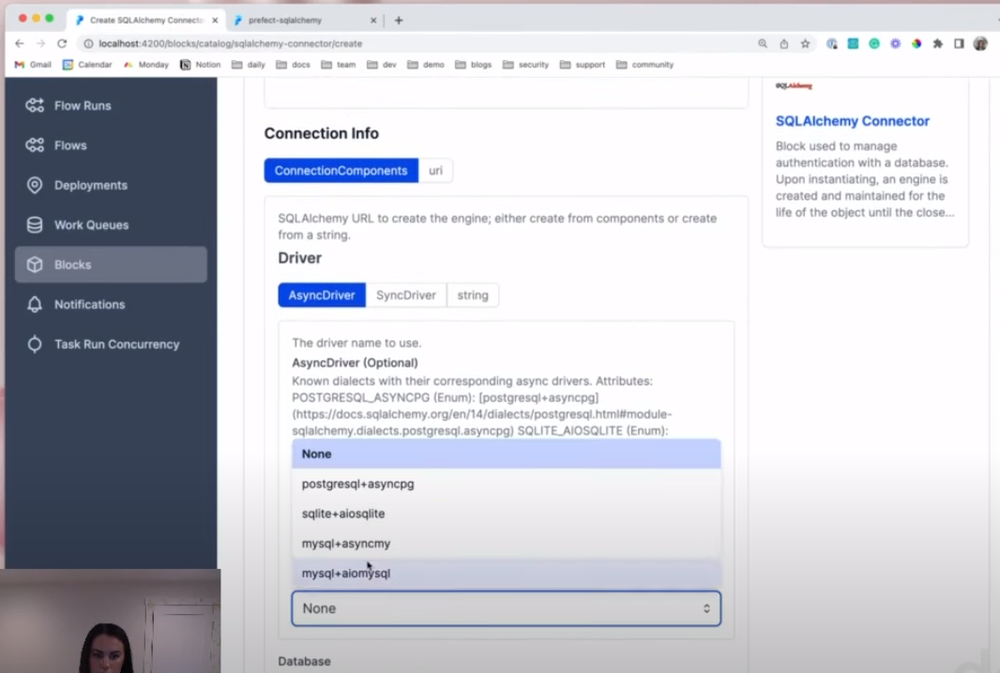

# Workflow Orchestration

## Table of contents
- [Basic concepts](#basic_-concepts) 
    - [Data Lake](#data-lake)
    - [ETL vs ELT](#etl-vs-elt)


## Basic concepts
### Data Lake
A data lake is a central repository that holds big data from many sources. This data can be structured, semi-structured or unstructured. The idea is to ingest data as quickly as possible and make it available or accessible to other team members (data scientists, data analysts...).

Generally, when ingesting data to the data lake, we would associate some sort of metadata for faster access.
- Differences between a data lake and a data warehouse:
    - Data lake
        - raw: unstructured
        - large: terabytes
        - undefined
        - users: data scientists, data analysts
        - use cases: stream processing, machine learning, real time analysis
    - Data warehouse
        - refined: structured
        - smaller
        - relational
        - users: business analysts
        - use cases: batch processing, BI, reporting

Gotchas of a data lake:
- converting into a data swamp
- no versioning
- incompatible schemas for the same data without versioning (for example, we write january taxi data in avro format, and next month we write it in parquet)
- no metadata associated
- joins not possible (no foreign keys available...)

And the cloud providers for data lakes are:
- *GCP* - Cloud Storage
- *AWS* - S3
- *Azure* - Blob storage

_[Back to the top](#table-of-contents)_

### ETL vs ELT
- *ETL*
    - stands for Extract, Transform and Load
    - mainly used for a small amount of data. It is data warehouse solution
    - schema on write, well-defined schema, relationships defined, and then we write the data
- *ELT*
    - stands for Extract, Load and Transform
    - used for large amounts of data
    - it is a data lake solution, and provides data lake support (Schema on read). We write the data first and determine the schema on the read

_[Back to the top](#table-of-contents)_


## Workflow orchestration

This time, the github repo link with the code is not contained in the DataTalkClub repo but in the [Prefect repo](https://github.com/discdiver/prefect-zoomcamp)

### Introduction to workflow orchestration
*Workflow orchestration* means governing our data flow in a way that respects orchestration rules and our business logic. It lets us turn any code into a workflow that we can schedule, run and observe. 


Some of the core features that a workflow orchestration tool needs to have are:
- remote execution
- scheduling
- retries
- caching
- integration with external systems (API, databases)
- Ad-hoc runs
- parametrization

### Introduction to Prefect
Prefect is a data flow automation platform, that allows to add observability and orchestration by using python, just to write code as workflows. It lets us run and monitor pipelines at scale.
First, lets install the next requirements
```python
pandas==1.5.2
prefect==2.7.7
prefect-sqlalchemy==0.2.2
prefect-gcp[cloud_storage]==0.2.4
protobuf==4.21.11
pyarrow==10.0.1
pandas-gbq==0.18.1
psycopg2-binary==2.9.5
sqlalchemy==1.4.46
```
Using the command
```bash
pip install -r requirements.txt
```
We can check that prefect was installed correctly by checking its version in the terminal
```bash
prefect version
```
Next, we are going to modify the `ingest_data.py` file from previous module, so we can add prefect features. 
`flows` is the most basic object from prefect. It is a container of workflow logic, that is going to allow us to interact and understand the state of the workflow. Flows are much like functions, they take inputs, they perform work, they return outputs. Flows contain tasks. And FLows can also contain another Flows.
It is a decorator we are going to add over a main function
```python
@flow(name='Ingest Flow')
def main_flow():
```
`tasks` can receive metadata about upstream dependencies, which gives the opportunity to have a task wait on the completition of another task before executing. Actually, they are not required for flows.
```python
@task(log_prints=True, retries=3)
def ingest_data(user, password, host, port, db, table_name, url):
```
- `log_prints`    
- `retries`: automatic retries. In this case is important, because we are pulling external data (taxi data), and if that fails, we want it to try again.

Next, we are going to add some steps to our ETL process. Let's continue by splitting the `ingest_data` function into more steps. The first step is going to be just an extract data step.
```python
@task(log_prints=True, retries=3)
def extract_data(log_prints=True, retries=3, cache_key_fn=task_input_hash, cache_expiration=timedelta(days=1))
```
- `cache_key_fn`: in case we are running several times a workflow with heavy computation, and we know it was already successful, we can pull from the cache result to make the execution go faster and efficiently
- `cache_expiration`


We can start the prefect UI (Orion) with the following command and see the flow runs:
```bash
prefect orion start
```
We can access it from the web browser in the url `localhost:4200`


`blocks` are going to enable the storage of configuration and provide an interface of interacting with external systems. There are several types of blocks. They are inmutable, so we can reuse these in multiple flow codes. Blocks can build upon bolcks.
Prefect have `collections` [catalog](https://docs.prefect.io/collections/catalog/) for integration.

Next, we are going to use the *SQL Alchemy* block in our *ingest_data_flow.py* file, to replace the connection, so we don't have to hardcode the user, password, host... First, in Orion, we need to add an sqlalchemy block, name it, specify the type of asyndriver (postgres) and the syncdriver (postgres+psycopg2 in our case), and specify the database name, username, password...



We add it into our code
```python
from prefect_sqlalchemy import SqlAlchemyConnector

connection_block@task(log_prints=True, retries=3)
def ingest_data(table_name, df):
    # specify the name of the block created in Orion
    connection_block = SqlAlchemyConnector.load('postgres-connector')

    with connection_block.get_connection(begin=False) as engine:

        df.head(n=0).to_sql(name=table_name, con=engine, if_exists='replace')
        df.to_sql(name=table_name, con=engine, if_exists='append')
```

### ETL with GCP and Prefect
The idea is we are going to create a python file with a main flow function that is going to call a number of other functions, that will be our task functions.
First we need to create a *bucket* in GCP. For that we go to *Cloud Storage > Create*
- Give it a unique permament name
Next, we need to create a block in Prefect. For that, we need to register them in the command line.
```bash
prefect block register -m prefect_gcp
```
And then in Orion, go to *Blocks* and click on `GCS Bucket`. Name it (for example *zoom-gcs*) and write the name of the bucket. Then, we add the credentials for accessing the gcp bucket. We need to create another block, a `GCP Credentials` block. We have to name it, and include the path to the *Service Account File* (the JSON file we used before to authenticate the our working machine with GCP in order to use for example Terraform). Then, back in the `GCS Bucket` we select the new `GCP Credentials` Block, and finally click on *Create*.

```python
@task()
def write_gcs(path: Path) -> None:
    '''Upload local parquet file to GCS'''
    gcs_block = GcsBucket.load('zoom-gcs')
    gcs_block.upload_from_path(
        from_path=path,
        to_path=path
    )
```
After these steps, we have created the `etl_web_to_gcs.py` file, so we can run it.
```bash
python etl_web_to_gcs.py
```

The next thing is to create another script to load the data from gcs (our data lake) to Big Query. For that, we need to create a BigQuery instance in GCP. In the portal, we go to *BigQuery > + Add Data > Popular sources: Google Cloud Storage*, browse and select the data we ingested to GCS. In dataset, select *Create* and name it `dezoomcamp`. Back to the main create table window, name the table `rides`, and click *Create table*. Once the table is created, we go a look for the table, and click on *Query*, we are going to delete the data, because we just needed the schema.
```sql
DELETE FROM gcp_project.dezoomcamp.rides WHERE true;
```
Then, we can execute the script `etl_gcs_to_bg.py`.
```bash
python etl_gcs_to_bg.py
```

### Parametrizing Flow and Deployments with ETL into GCS flow

For not having to run the etls manually from the terminal, we can do it and schedule in Prefect. Deployment in Prefect is a server-side concept that encapsulates a flow allowing it to be scheduled and triggered via the [API](https://docs.prefect.io/concepts/deployments/). Using a deployment, we are going to be able to have our flow code and a deployment definition, so Prefect now know that, for example, there is a flow that maybe runs on a schedule.  
There are two main ways to build a `deployment`. One is through the CLI and the other is through python.
To buil a deployment, first we have modified a little our `etl_web_to_gcs.py` script and introduced a parent flow that introduces parameter into the etl_web_to_gcs flow function. The resulting script is called `parametrized_flow.py`. Then we can build the deployment from this script through the command line:
```bash
prefect deployment build ./parametrized_flow.py:etl_parent_flow -n "Parametrized ETL"
```
We specify:
- the script: `parametrized_flow.py`
- the entrypoint function: `etl_parent_flow`
- a name: `Parametrized ETL`
Once we run the command, a file `etl_parent_flow-deployment.yaml` will be created. This is all that metadata the the deployment needs to know. Having a look at the file, we see that has some fields for parameters. We can introduce the parameters in here.

Then, we have to apply this deployment to Prefect:
```bash
prefect deployment apply etl_paren_flow-deployment.yaml
```
This command send all of the metadata over the Prefect API. We can inspect it in the Prefect Orion UI, and we can even modify again the paremeters we specified before.

`Work Queues` and `agents`, an `agent` is a very lightweight python process that is living in the execution environment. This agent is pulling from a `work queue` (we need to have a deployment run in a work queue). To start the agent, we run:
```bash
prefect agent start --work-queue "deafult"
```

We can create a `notification` for when the process finishes, even if it is successfully or not. For that we click on *Notificatons* in the left tab on th UI.