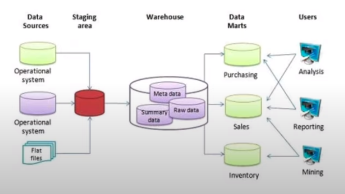
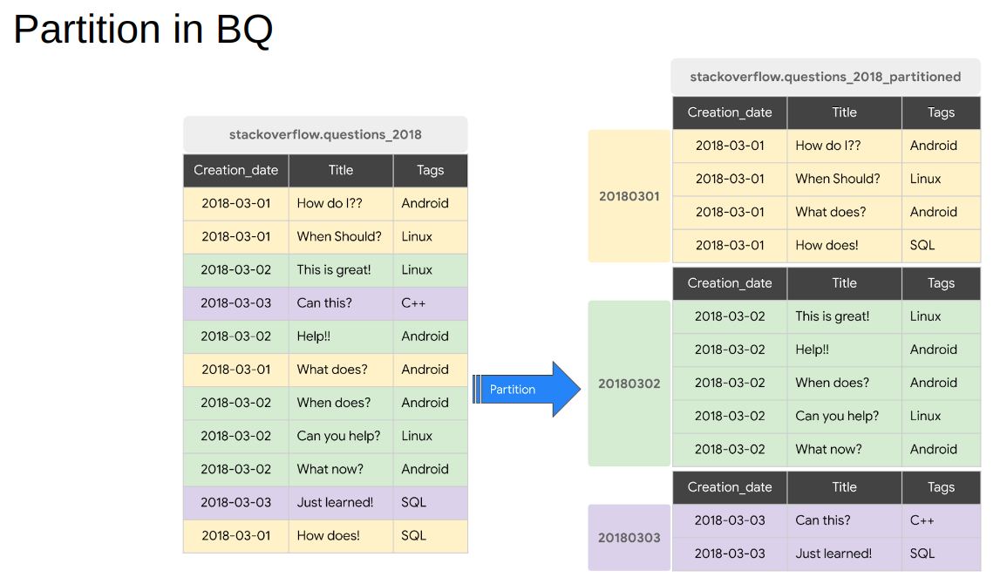
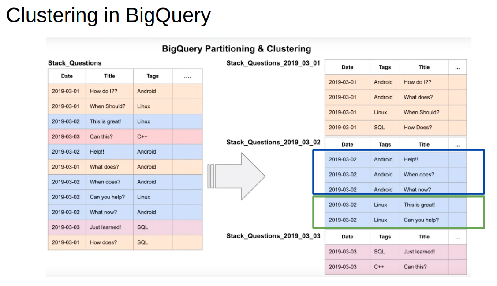

# Data Warehouse

## Table of contents
- [Basic concepts](#basic_-concepts) 
    - [Data Lake](#data-lake)
    - [ETL vs ELT](#etl-vs-elt)


## Basic concepts
### OLAP vs OLTP
*OLTP* stands for OnLine Transaction Processing, while *OLAP* stands for OnLine Analytical Processing.   
The main differences are:  

|                         | OLTP                                                                                              | OLAP                                                                              |
|-------------------------|---------------------------------------------------------------------------------------------------|-----------------------------------------------------------------------------------|
| **Purpose**             | control and run essential business  operations in real time                                       | plan, solve problems, support decisions,  discover hidden insights                |
| **Data updates**        | short, fast updates initiated by user                                                             | plan, solve problems, support decisions, discover hidden insights                 |
| **Database design**     | normalized databases for efficiency                                                               | denormalized databases for analysis                                               |
| **Space requirements**  | generally small if historical data is archived                                                    | generally large due to aggregating large datasets                                 |
| **Backup and recovery** | regular backups required to ensure business continuity and meet legal and governance requirements | lost data can be reloaded from OLTP database as needed instead of regular backups |
| **Productivity**        | increases productivity of end users                                                               | increases productivity of business managers, data analysts, and executives        |
| **Data view**           | Lists day-to-day business transactions                                                            | Multi-dimensional view of enterprise data                                         |

### Data Warehouse
- A data warehouse is an OLAP solution. 
- It is used mainly for reporting and data analysis. 
- It consists of raw data, metadata and summary data.



They can be converted into datamarts, as seen in the imnage. This datamarts serve data to different business units.

## BigQuery

BigQuery is serverless data warehouse solution. It is considered a software as well as infrastructure with scalability and high availability in mind.  
BigQuery has another big advantege. Normally when you have one big server with storage and compute together, you need to increase the machine once the data increases. on the other hand, BigQuery has flexibility by separating the compute engine that analyzes the data from the storage.

>BigQuery normally caches data. For our purpose, we are going to disable this feature in the query tab of the UI of BigQuery, we untick on *More > Query Settings > Cache preference > Use cached results*

BigQuery offers some public data, as the "New York city bike" dataset. We can play with it by searching in the BigQuery's toolbar for `citibike_stations`.

We can create a table from a file in our Clou Storage by running the next command in a BigQuery editor tab:

```sql
-- Creating external table referring to gcs path
CREATE OR REPLACE EXTERNAL TABLE `taxi-rides-ny.nytaxi.external_yellow_tripdata`
OPTIONS (
  format = 'CSV',
  uris = ['gs://nyc-tl-data/trip data/yellow_tripdata_2019-*.csv', 'gs://nyc-tl-data/trip data/yellow_tripdata_2020-*.csv']
);
```

### Partitioning

One good thing is that BigQuery is going to infer the schema on the fly. We can modify it later if it is not correct. Another important thing is `partitioning` in BigQuery, that can really improve the performance. We can partition a table by a column, normally it's done by a date column when the queries tend to have a where clause that includes the date.



Some details to take into account about partitioning are:
- We can use:
    - Time-unit column: can be daily(default), hourly, monthly o yearly
    - Ingestion time (_PARTITIONTIME)
    - Integer range partitioning
- The maximum number of partitions is 4,000

To partition the previous created table, we can do it with:

```sql
-- Create a partitioned table from external table
CREATE OR REPLACE TABLE taxi-rides-ny.nytaxi.yellow_tripdata_partitoned
PARTITION BY
  DATE(tpep_pickup_datetime) AS
SELECT * FROM taxi-rides-ny.nytaxi.external_yellow_tripdata;
```

To check how many rows do we have in each partition, we run:

```sql
-- Let's look into the partitions
SELECT table_name, partition_id, total_rows
FROM `nytaxi.INFORMATION_SCHEMA.PARTITIONS`
WHERE table_name = 'yellow_tripdata_partitoned'
ORDER BY total_rows DESC;
```

### Clustering

Moving ahead from partitioning, there is another interesting concept in BigQuery which is clustering. `Clustering` is grouping together rows by other column that is not the one used for partitioning.



Some important information about clustering:
- We can specify up to four clustering columns
- The order of the specified columns determines the sort order of the data (I guess this applies when clustering with several columns: it is not the same order fisrt column A, then B and then C, that doing it the other way around)
- It improves filter queries and aggregate queries
- We see more clearly the improvements on the efficiency as the data size increases

To make a clusters and a partition we do:

```sql
-- Creating a partition and cluster table
CREATE OR REPLACE TABLE taxi-rides-ny.nytaxi.yellow_tripdata_partitoned_clustered
PARTITION BY DATE(tpep_pickup_datetime)
CLUSTER BY VendorID AS
SELECT * FROM taxi-rides-ny.nytaxi.external_yellow_tripdata;
```

When we add new data to a clustered table, BigQuery performs automatic re-clustering in the background to restore the sort property of the table, with no cost for us.

### Partitioning vs Clustering

| Partitioning                         | Clustering                                                                          |
|--------------------------------------|-------------------------------------------------------------------------------------|
| Cost known upfront                   | Cost benefit unknown                                                                |
| We need partition-level management   | We need more granularity than partitioning alone allows                             |
| Filter or aggregate on single column | Our queries commonly use filters or aggregation against multiple particular columns |
|                                      | The cardinality of the number of values in a column or group of columns is large    |

Clustering over partitioning:
- Partitioning results in a small amount of data per partition (apro. less than 1 GB)
- Partitioning results in a large number of partitions beyong the limits on partitioned tables
- Partitioning results in our mutation operations modifying the majority of partitions in the table frequently

