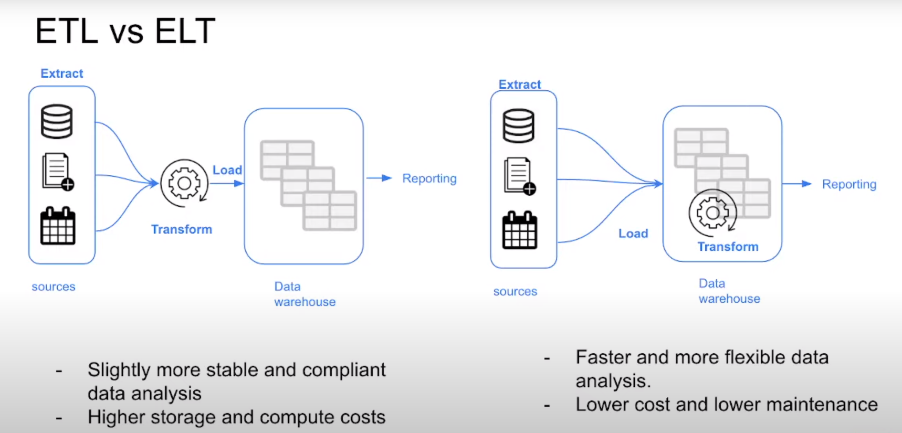
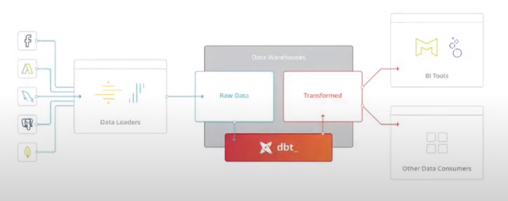
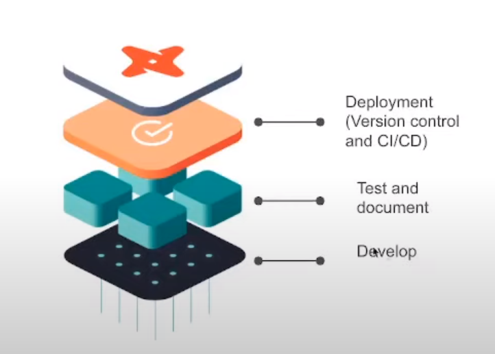

# Analytics Engineering

## Table of contents
- [Basic concepts](#basic_-concepts) 
    - [Analytics Engineering Basics](#analytics-engineering-basics)

## Basic concepts
### Analytics Engineering Basics

As the _data domain_ has developed over time, new tools have been introduced that have changed the dynamics of working with data:

1. Massively parallel processing (MPP) databases
    * Lower the cost of storage 
    * BigQuery, Snowflake, Redshift...
1. Data-pipelines-as-a-service
    * Simplify the ETL process
    * Fivetran, Stitch...
1. SQL-first / Version control systems
    * Looker...
1. Self service analytics
    * Mode...
1. Data governance

The introduction of all of these tools changed the way the data teams work as well as the way that the stakeholders consume the data, creating a gap in the roles of the data team. Traditionally:

* The ***data engineer*** prepares and maintains the infrastructure the data team needs.
* The ***data analyst*** uses data to answer questions and solve problems (they are in charge of _today_).
* The ***data scientist*** predicts the future based on past patterns and covers the what-ifs rather than the day-to-day (they are in charge of _tomorrow_).

However, with the introduction of these tools, both data scientists and analysts find themselves writing more code even though they're not software engineers and writing code isn't their top priority.  Data engineers are good software engineers but they don't have the training in how the data is going to be used  by the business users.

The ***analytics engineer*** is the role that tries to fill the gap: it introduces the good software engineering practices to the efforts of data analysts and data scientists. The analytics engineer may be exposed to the following tools:
1. Data Loading (Stitch...)
1. Data Storing (Data Warehouses)
1. Data Modeling (dbt, Dataform...)
1. Data Presentation (BI tools like Looker, Mode, Tableau...)

This lesson focuses on the last 2 parts: Data Modeling and Data Presentation.

### ETL vs ELT

We saw the differences in chapter 2, but we revisit it.

The first approach, the ETL, is going to take longer to implement because first we have to transform that data. But this also means that we are going to have more stable and compliant data because it is clean.  
On the other hand, the ELT, it is going to be faster and flexible, because we already have the data loaded in the data lake. This is also taking advantage of the cloud data warehousing that lowered the cost of storage and compute.

### Kimballs' Dimensional Modelling

[Ralph Kimball's Dimensional Modeling](https://www.wikiwand.com/en/Dimensional_modeling#:~:text=Dimensional%20modeling%20(DM)%20is%20part,use%20in%20data%20warehouse%20design.) is an approach to Data Warehouse design which focuses on 2 main points:
* Deliver data which is understandable to the business users.
* Deliver fast query performance.

Other goals such as reducing redundant data (prioritized by other approaches such as [3NF](https://www.wikiwand.com/en/Third_normal_form#:~:text=Third%20normal%20form%20(3NF)%20is,integrity%2C%20and%20simplify%20data%20management.) by [Bill Inmon](https://www.wikiwand.com/en/Bill_Inmon)) are secondary to these goals. Dimensional Modeling also differs from other approaches to Data Warehouse design such as [Data Vaults](https://www.wikiwand.com/en/Data_vault_modeling).

Dimensional Modeling is based around 2 important concepts:
* ***Fact Table***:
    * _Facts_ = _Measures_
    * Typically numeric values which can be aggregated, such as measurements or metrics.
        * Examples: sales, orders, etc.
    * Corresponds to a [_business process_ ](https://www.wikiwand.com/en/Business_process).
    * Can be thought of as _"verbs"_.
* ***Dimension Table***:
    * _Dimension_ = _Context_
    * Groups of hierarchies and descriptors that define the facts.
        * Example: customer, product, etc.
    * Corresponds to a _business entity_.
    * Can be thought of as _"nouns"_.
* Dimensional Modeling is built on a [***star schema***](https://www.wikiwand.com/en/Star_schema) with fact tables surrounded by dimension tables.

A good way to understand the _architecture_ of Dimensional Modeling is by drawing an analogy between dimensional modeling and a restaurant:
* Stage Area:
    * Contains the raw data.
    * Not meant to be exposed to everyone.
    * Similar to the food storage area in a restaurant.
* Processing area:
    * From raw data to data models.
    * Focuses in efficiency and ensuring standards.
    * Similar to the kitchen in a restaurant.
* Presentation area:
    * Final presentation of the data.
    * Exposure to business stakeholder.
    * Similar to the dining room in a restaurant.

_[Back to the top](#)_

## DBT

[DBT](https://www.getdbt.com/) stands for data-build-tool. It is a transformation tool that allows anyone that knows SQL to deploy analytics code following software engineering best practices like modilarity, portability, CI/CD, and documentation.

After we have done the extraction and loading of the data, we are going to have a lot of raw data in our data warehouse (¿data lake?). We need to transform this data to later expose it to our stakeholders and be able to perform analysis. That transformation is going to be done with **dbt**. It not only is going to help us transform our data in the data warehouse, but also it's going to introduce the good software practices by defining a *deployment workflow*: we are going to develop our models, we are going to test and documento them, and then we're going to have a deployment phase, where we are going to use version control and implement CI/CD as well.

Each model is:
- a sql file
- with a select statement and no DDL or DML
- a file that dbt will compile and run in our DWH

### How to use dbt?

**dbt Core** is the essence of dbt: it is an open source project that allows the data transforamtion. 
- this is the part of bdt that's going to build and run the project (.sql and .yml files)
- includes SQL compilation logic, macros (functions) and database adapters
- includes a CLI interface to run dbt commands locally
- open source and free to use

There is another part from dbt which is **dbt Cloud**. 
- this is a web-based IDE to develop, run and test a dbt project
- jobs orchestration
- logging and alerting
- integrated documentation
- free for individuals (one developer seat)

### How are we going to use dbt?

