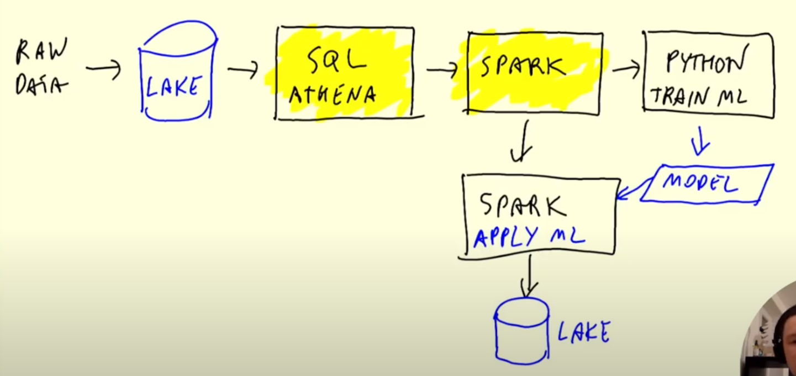

# Batch Processing

## Table of contents
- [Basic concepts](#basic_-concepts) 
    - [Analytics Engineering Basics](#analytics-engineering-basics)
    - [ETL vs ELT](#etl-vs-elt)

## Basic Concepts
### Batch pocessing

There are 2 ways of processing data: batch and streaming. In `batch processing` we take and process a chunck of data at the same time. It can be, for example, running a job that takes as input all the rows corresponding to the month january, and procuce a new dataset. In `streaming processing` the data is taken and processed on the fly, it means record by record at the moment the record is being generated. The way of processing is going to be adressed in next module.

Batch jobs are usually run at different **time intervals**:
- weekly
- daily
- hourly
- 3 times per hour
- every 5 minutes
Most common ones are daily and hourly.

The **technologies** used to run these jobs are:
- python scripts (seen at week 2): can be run anywhere, such us kubernetes, aws batch... and what it is tipically used to orchestrate these jobs is prefect / airflow.
- sql (seen at week 4)
- spark
- flink
- ...

Some **advantages** of batch jobs are:
- easy to manage: we can define steps, parametrize the scripts
- retry, in case of failure
- scale 

And some **disadvantages** are:
- delay, as we run the jobs in regular intervals we have to wait then to the run to be able to analyse the latest data. The same with the processing time needed for the job to be run.

## Spark
### Introduction to Spark
It is a multilanguage data processing engine. 
- It is an engine in the way that it takes data from a database, makes some transormations over it, and loads it back to another database.
- It is multilanguage because you can use Java and Scala (Scala is the native way of communicating with Spark as Spark is written in Scala), and there are wrappers for python (it is called pyspark) and R.

Spark is used for executing batch jobs, but it can also be used for streaming (you can see streaming as a sequence of small batches).

When to use Spark?
- when the data is in a data lake (some location in GCS / S3 / Blob) sstored, for example, in parquet files. Then Spark pulls this data, do some processing, and then put this data back to the data lake. We would use it for the same things we use SQL, but in this case we don't have a data warehouse. When we have a data warehouse (BigQuery...) we can use SQL, but SQL is not alway easy to use when what we have is a bunch of parquet files (although there are some tools to run SQL over a data lake such us HIVE, Presto, AWS Athena...). if we can express our job with SQL, it is normally better to go with this last solutions. But sometimes we need more flexibility, that is when we would use Spark.

A tipical machine learning workflow involving Saprk would be:

### Installing Spark

To install Spark on a Linux machine (in my case a google virtual machine) follow this [tutorial](https://github.com/DataTalksClub/data-engineering-zoomcamp/blob/main/week_5_batch_processing/setup/linux.md). We will need to install Java first, and then Spark, and export some variables to everything be able to work fine.

###

